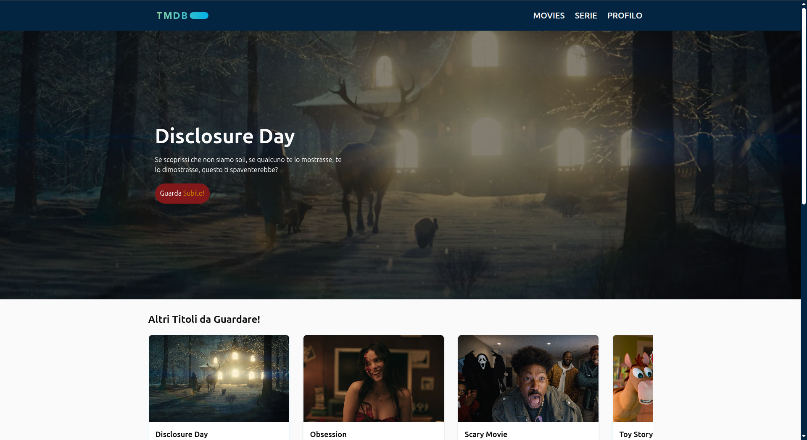
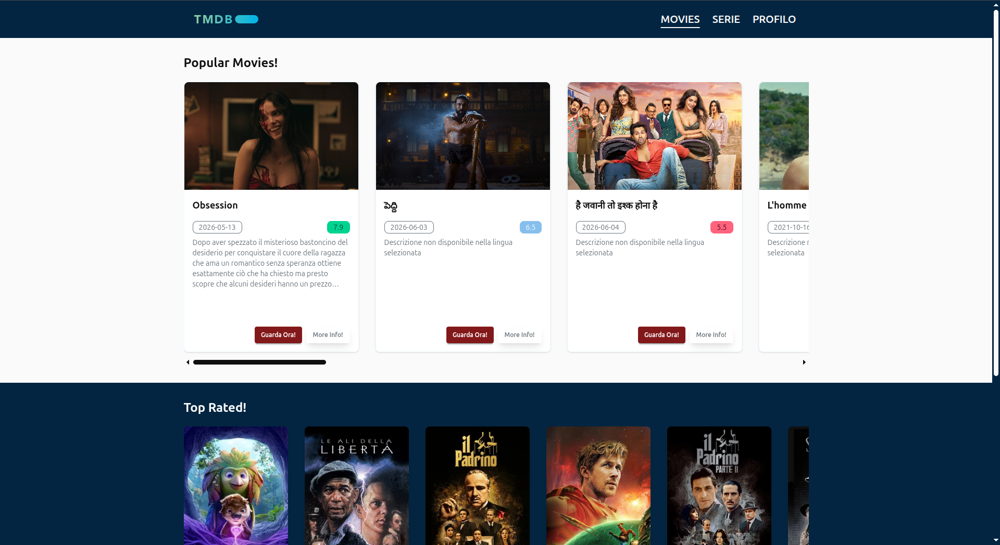
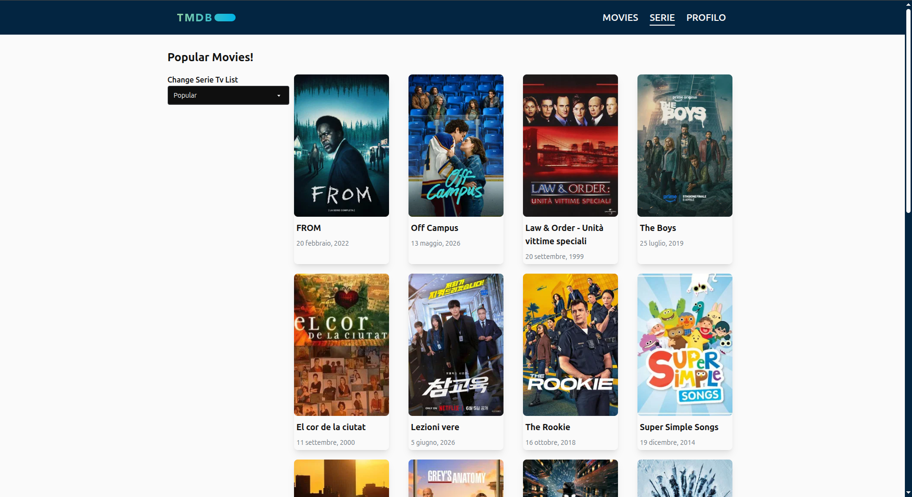
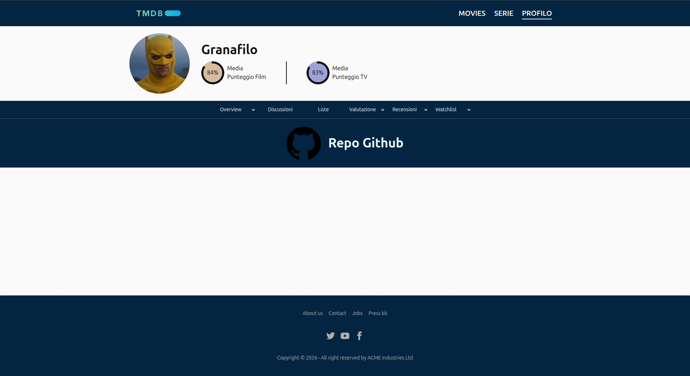

# Movie App Granata

[](https://vite.dev/)
[](https://developer.mozilla.org/docs/Web/JavaScript)
[](https://tailwindcss.com/)
[](https://daisyui.com/)
[](https://developer.themoviedb.org/docs)
[]()

Applicazione web multi-pagina in stile streaming, sviluppata con HTML, CSS, JavaScript e Vite. Il progetto consuma le API di TMDB per mostrare film, serie TV, attori e dettagli dinamici, sostituendo i contenuti statici con dati reali provenienti dal servizio esterno.

## Panoramica

L'obiettivo del progetto e` creare una piccola piattaforma di navigazione cinematografica ispirata ai cataloghi streaming, con:

- homepage dinamica con hero, contenuti consigliati e attori popolari;
- pagina film con liste dedicate;
- pagina serie con filtro e paginazione;
- pagina dettaglio per film e serie;
- pagina profilo statica con informazioni sul progetto;
- interfaccia responsive con drawer menu su mobile e navigazione orizzontale su desktop.

Il progetto e` stato pensato come esercizio completo di frontend: struttura semantica, componenti DOM creati via JavaScript, chiamate `fetch`, gestione dello stato di caricamento, fallback sui dati mancanti e separazione della logica in moduli.

## Stack Tecnico

- **Vite** per sviluppo e build.
- **JavaScript ES modules** per la logica applicativa.
- **Tailwind CSS 4** per la gestione degli utility class.
- **DaisyUI** per componenti e pattern visivi gia` pronti.
- **TMDB API** come fonte dati esterna.

## Anteprima

L'interfaccia e` pensata per ricordare un piccolo catalogo streaming: hero d'apertura, card orizzontali, griglia responsive, menu drawer su mobile e navigazione desktop con stato attivo ben visibile.

### Home



### Film



### Serie



### Profilo



Le immagini sono salvate in [docs/screenshots](docs/screenshots) per tenere separata la documentazione dagli asset dell'app.

## Struttura Del Progetto

```text
movieapp-granata/
├── index.html
├── movies.html
├── serie.html
├── details.html
├── profile.html
├── README.md
├── docs/
│   └── TRACCIA-ESAME.md
├── public/
├── src/
│   ├── main.js
│   ├── movies.json
│   ├── components/
│   │   ├── actorCard.js
│   │   ├── filmCard.js
│   │   ├── hero.js
│   │   └── viewMoreCard.js
│   ├── pages/
│   │   ├── details.js
│   │   ├── movies.js
│   │   └── series.js
│   ├── style/
│   │   └── style.css
│   └── utils/
│       ├── normalizzaAttore.js
│       ├── normalizzaMedia.js
│       └── utils.js
└── vite.config.js
```

Nota: il file della pagina serie si chiama `serie.html` nel repository attuale.

## Funzionalita` Principali

### Homepage

- Hero dinamico con titolo, descrizione e background aggiornato tramite API TMDB.
- Sezione "Altri titoli da guardare" popolata con contenuti trending.
- Sezione "Attori in hype al momento" popolata con attori popolari.
- Card create dinamicamente con JavaScript, senza array statici fissi nel rendering finale.

### Pagina Film

- Sezione film popolari.
- Sezione top rated.
- Click sulle card per aprire la pagina dettaglio.

### Pagina Serie

- Filtro per cambiare la lista di serie (`popular`, `on_the_air`, `airing_today`, `top_rated`).
- Paginazione con bottoni precedente / successivo.
- Rendering dinamico delle card in griglia responsive.

### Pagina Dettaglio

- Supporto sia per film sia per serie tramite parametri in query string.
- Visualizzazione di poster, titolo, anno, data completa, generi, overview e voto.
- Sezione cast con card attori.
- Fallback per descrizioni mancanti.

### Pagina Profilo

- Pagina statica senza dipendenza obbligatoria dalle API.
- Usata per presentare il progetto e il relativo contesto.

## API TMDB Utilizzate

Le richieste sono tutte `GET` e passano tramite header `Authorization` configurato in ambiente locale.

### Endpoint Usati Nella Versione Attuale

- Homepage:
  - `https://api.themoviedb.org/3/trending/all/day?language=it-IT`
  - `https://api.themoviedb.org/3/person/popular?language=it-IT&page=1`
- Homepage hero immagini:
  - `https://api.themoviedb.org/3/movie/{id}/images`
  - `https://api.themoviedb.org/3/tv/{id}/images`
- Pagina film:
  - `https://api.themoviedb.org/3/movie/popular?language=it-IT&page=1&region=eu`
  - `https://api.themoviedb.org/3/movie/top_rated?language=it-IT&page=1&region=eu`
- Pagina serie:
  - `https://api.themoviedb.org/3/tv/{filter}?language=it-IT&page={page}&region=eu`
- Dettaglio film:
  - `https://api.themoviedb.org/3/movie/{id}?language=it-IT`
  - `https://api.themoviedb.org/3/movie/{id}/credits?language=en-US`
- Dettaglio serie:
  - `https://api.themoviedb.org/3/tv/{id}?language=it-IT`
  - `https://api.themoviedb.org/3/tv/{id}/aggregate_credits?language=en-US`

Per le immagini TMDB viene usato il dominio `https://image.tmdb.org/t/p/` con formati diversi a seconda del contesto (`original`, `w220_and_h330_face`, ecc.).

## Configurazione Ambiente

Il progetto si aspetta una variabile ambiente per l'autenticazione alle API TMDB.

### File `.env`

```bash
VITE_API_KEY_TMDB=Bearer LA_TUA_CHIAVE_O_TOKEN
```

La chiave non deve essere committata: il repository ignora gia` i file `.env` e `*.local`.

## Installazione E Avvio

### Requisiti

- Node.js installato localmente.
- npm disponibile nel sistema.

### Passi

```bash
npm install
```

```bash
npm run dev
```

Il server di sviluppo Vite rendera` il sito in locale.

### Build Di Produzione

```bash
npm run build
```

### Preview Della Build

```bash
npm run preview
```

## Script Disponibili

```json
{
  "dev": "vite",
  "build": "vite build",
  "preview": "vite preview"
}
```

## Architettura Del Codice

### `src/utils`

- `utils.js`: wrapper per `fetch`, opzioni comuni e utility come `wait`.
- `normalizzaMedia.js`: normalizza film e serie in un formato uniforme.
- `normalizzaAttore.js`: normalizza i dati degli attori per le card e il dettaglio.

### `src/components`

- `filmCard.js`: card film/serie per hero list e liste compatte.
- `actorCard.js`: card attori in versione overlay e standard.
- `hero.js`: gestione del hero della homepage con immagini di sfondo dinamiche.
- `viewMoreCard.js`: card finale "Visualizza altro" quando la lista supera il limite visibile.

### `src/pages`

- `movies.js`: logica della pagina film.
- `series.js`: logica della pagina serie con filtro e paginazione.
- `details.js`: logica della pagina dettaglio film/serie.

### `src/main.js`

Gestisce la homepage: caricamento dei contenuti, popolamento delle card, hero dinamico e retry automatici in caso di errore temporaneo della fetch.

## Gestione Dei Casi Limite

Il progetto non si limita a mostrare i dati, ma gestisce anche alcune situazioni problematiche.

### Caricamento E Retry

- Presenza di spinner di caricamento durante le richieste.
- Tentativi ripetuti fino a 5 volte con attesa progressiva in caso di errore.

### Dati Mancanti

- Overview di default quando la descrizione non e` presente.
- Immagini profilo alternative quando `profile_path` e` nullo.
- Supporto a titoli diversi tra film e serie (`title` oppure `name`).
- Formattazione robusta della data di uscita.

### Interazione E Navigazione

- Click sulle card per aprire il dettaglio.
- Drawer navigation su mobile.
- Evidenziazione della voce attiva nel menu desktop.

### Limiti Di Pagina

- La pagina serie usa paginazione con controllo minimo e massimo.
- I bottoni precedente / successivo vengono disabilitati quando necessario.

## Processo Di Sviluppo

La cronologia Git mostra un'evoluzione a fasi molto chiara:

1. **Inizializzazione progetto**: creazione della base Vite e della struttura iniziale.
2. **Homepage dinamica**: sostituzione dei contenuti statici con film e attori ottenuti da TMDB.
3. **Creazione pagine dedicate**: aggiunta di `movies.html`, `serie.html`, `details.html` e `profile.html`.
4. **Refactor strutturale**: normalizzazione dei dati, separazione in componenti e miglioramento della riusabilita`.
5. **Serie con filtri e paginazione**: aggiunta della lista dinamica per le serie TV.
6. **Rifinitura finale**: miglioramenti al hero, al profilo e al comportamento generale delle pagine.

In pratica, il progetto e` passato da una homepage inizialmente basata su dati statici a una piccola applicazione completa, con vista home, liste dedicate, dettaglio e gestione degli stati di caricamento.

## Analisi Delle Scelte Tecniche

- La logica e` divisa in file piccoli e mirati per mantenere il codice leggibile.
- Le card vengono create via DOM API per rimanere fedeli agli obiettivi didattici del corso.
- I dati vengono normalizzati prima del rendering per ridurre la duplicazione di logica tra film, serie e attori.
- La UI usa DaisyUI per velocizzare layout e componenti senza ricorrere a framework frontend complessi.
- Il layout e` pensato per schermi piccoli e grandi, con drawer laterale su mobile e navigazione classica su desktop.

## Note Sul Progetto

- Non e` presente un backend proprietario: tutto il contenuto dinamico arriva da TMDB.
- Non sono necessari framework come React, Vue o Angular.
- Il progetto e` stato costruito per essere leggibile, presentabile e facilmente estendibile.
- L'API key deve restare locale e non va pubblicata sul repository.

## Possibili Miglioramenti Futuri

- Aggiungere una ricerca testuale.
- Migliorare l'accessibilita` dei componenti interattivi.
- Gestire uno stato di errore visibile a schermo quando le API non rispondono.
- Rendere cliccabili anche le card attore con una pagina dedicata al profilo TMDB.
- Aggiungere test automatici o controlli di lint piu` strutturati.

## Autore

- Progetto realizzato da **granafilo**.

## Riferimenti

- [TMDB API Docs](https://developer.themoviedb.org/docs)
- [TMDB API Terms of Use](https://www.themoviedb.org/api-terms-of-use)
